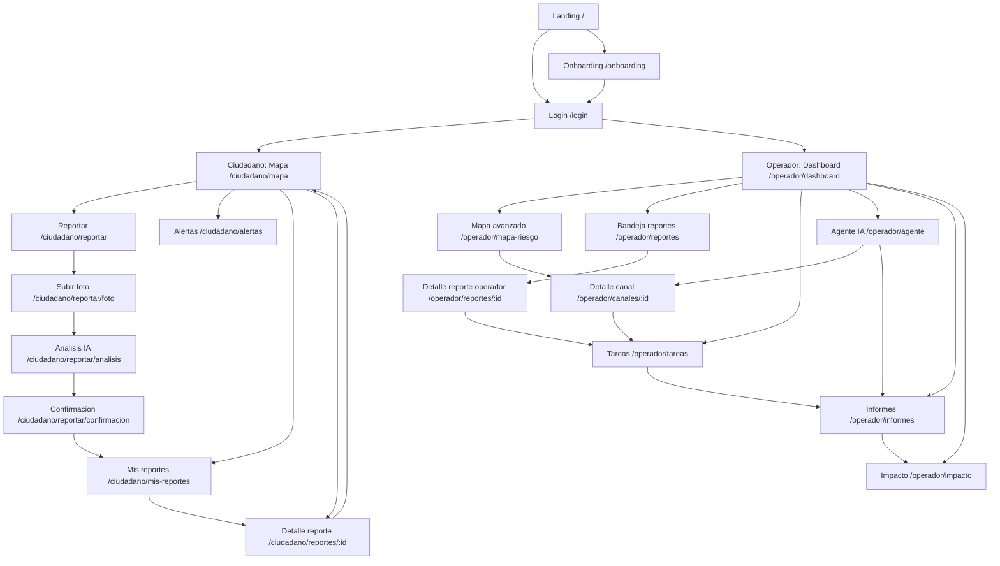

# DrenaCruz AI — Plan de diseno UI Web interactivo para Stitch

> **Objetivo del documento:** servir como prompt/brief de diseno para crear un prototipo web interactivo en Stitch.  
> **Producto:** DrenaCruz AI, plataforma web para predecir riesgo de inundacion en canales de drenaje de Santa Cruz de la Sierra, combinando reportes ciudadanos, analisis visual con IA, clima, historial de puntos criticos y priorizacion de limpieza.

---

## 1. Resumen del producto

**DrenaCruz AI** ayuda a anticipar donde y cuando pueden inundarse canales o calles cercanas a canales de drenaje. La plataforma permite que vecinos reporten puntos con basura, maleza, sedimento o agua acumulada mediante foto y ubicacion. La IA analiza la imagen, clasifica el tipo de obstruccion y calcula un riesgo. El municipio, juntas vecinales o equipos operativos pueden ver un mapa de riesgo, priorizar cuadrillas, emitir alertas y generar informes.

### Promesa principal

> "Convertimos fotos y reportes ciudadanos en inteligencia urbana para prevenir inundaciones antes de que lleguen a las casas, negocios y avenidas."

### Usuarios principales

1. **Ciudadano / vecino**
   - Reporta canales bloqueados, calles inundadas o agua estancada.
   - Consulta alertas y estado de sus reportes.

2. **Operador municipal / junta vecinal / equipo de drenaje**
   - Revisa dashboard de riesgo.
   - Prioriza limpieza.
   - Asigna tareas a cuadrillas.
   - Genera alertas e informes.

3. **Administrador / analista**
   - Configura canales, zonas, usuarios, pesos del modelo y datos de referencia.

---

## 2. Instrucciones generales para Stitch

Crear un **prototipo web responsive e interactivo** en espanol, con navegacion funcional entre pantallas. El prototipo debe sentirse como un producto listo para demo de hackathon.

### Estilo visual

- Estetica: civic-tech, limpia, moderna, confiable.
- Sensacion: urgencia preventiva, no alarmista.
- Tema visual: agua urbana, drenaje, mapas, reportes ciudadanos.
- Ciudad objetivo: Santa Cruz de la Sierra, Bolivia.
- Usar mapas, tarjetas, semaforos de riesgo, alertas y paneles analiticos.
- Usar microcopy claro y accionable.

### Paleta sugerida

| Uso | Color sugerido |
|---|---|
| Primario agua | Azul profundo `#0B5CAD` |
| Secundario | Turquesa `#00A6A6` |
| Riesgo bajo | Verde `#22C55E` |
| Riesgo medio | Amarillo/ambar `#F59E0B` |
| Riesgo alto | Rojo `#EF4444` |
| Fondo | Gris muy claro `#F8FAFC` |
| Texto principal | Gris noche `#0F172A` |
| Texto secundario | Gris `#64748B` |
| Superficies | Blanco `#FFFFFF` |

### Tipografia

- Usar sans-serif moderna.
- Jerarquia clara:
  - H1 grande para titulos.
  - H2 para secciones.
  - Cards con subtitulos y metricas.
  - Texto corto, directo y escaneable.

### Componentes globales

- **AppShell ciudadano:** top bar + bottom navigation.
- **AppShell operador:** sidebar izquierda + top bar.
- **RiskBadge:** Bajo / Medio / Alto / Critico.
- **MapPin:** punto de reporte con color por riesgo.
- **CanalCard:** resumen de canal o zona critica.
- **ReportCard:** reporte ciudadano con foto, ubicacion, estado e IA.
- **AIAnalysisPanel:** resultado del analisis de imagen.
- **PriorityTable:** tabla de priorizacion de canales.
- **AgentChat:** chat con agente IA.
- **WeatherCard:** clima y lluvia prevista.
- **Timeline:** seguimiento de reporte o tarea.
- **TaskCard:** tarea de limpieza/inspeccion.
- **ImpactCard:** Bs ahorrados, reportes atendidos, basura retirada, riesgo reducido.
- **Toast:** confirmaciones, errores y estados.
- **Modal:** confirmaciones de envio, asignacion de cuadrilla, alerta ciudadana.
- **EmptyState:** cuando no hay reportes, tareas o alertas.
- **LoadingState:** analizando imagen, calculando riesgo, generando informe.

---

## 3. Arquitectura de informacion

### Navegacion publica

- `/` — Landing / seleccion de rol
- `/login` — Inicio de sesion
- `/onboarding` — Explicacion breve del producto

### Navegacion ciudadano

- `/ciudadano/mapa` — Mapa ciudadano de riesgo
- `/ciudadano/reportar` — Inicio de reporte
- `/ciudadano/reportar/foto` — Subir foto o tomar foto
- `/ciudadano/reportar/analisis` — Resultado IA editable
- `/ciudadano/reportar/confirmacion` — Confirmacion del reporte
- `/ciudadano/mis-reportes` — Historial de reportes
- `/ciudadano/reportes/:id` — Detalle de reporte
- `/ciudadano/alertas` — Alertas cercanas
- `/ciudadano/perfil` — Perfil y preferencias

### Navegacion operador

- `/operador/dashboard` — Panel principal
- `/operador/mapa-riesgo` — Mapa avanzado de riesgo
- `/operador/canales` — Catastro inteligente de canales
- `/operador/canales/:id` — Detalle de canal/zona critica
- `/operador/reportes` — Bandeja de reportes ciudadanos
- `/operador/reportes/:id` — Detalle de reporte ciudadano
- `/operador/tareas` — Gestion de tareas y cuadrillas
- `/operador/agente` — Agente IA de recomendaciones
- `/operador/informes` — Informes y exportacion
- `/operador/impacto` — Indicadores de impacto
- `/operador/configuracion` — Configuracion del modelo y usuarios

---

## 4. Mapa de navegabilidad interactiva

> En Stitch, cada tarjeta, CTA, pin de mapa, item de tabla y accion principal debe navegar a la pantalla indicada.



---

## 5. Navegacion global por rol

### Ciudadano

Usar **bottom navigation** en mobile y top nav simple en desktop.

| Item | Ruta | Icono sugerido | Funcion |
|---|---|---|---|
| Mapa | `/ciudadano/mapa` | mapa | Ver riesgo cercano |
| Reportar | `/ciudadano/reportar` | camara / mas | Crear reporte |
| Alertas | `/ciudadano/alertas` | campana | Ver alertas |
| Mis reportes | `/ciudadano/mis-reportes` | lista | Seguimiento |
| Perfil | `/ciudadano/perfil` | usuario | Preferencias |

### Operador

Usar **sidebar izquierda fija** en desktop y drawer en mobile/tablet.

| Item | Ruta | Funcion |
|---|---|---|
| Dashboard | `/operador/dashboard` | Vision general |
| Mapa de riesgo | `/operador/mapa-riesgo` | Gestion espacial |
| Canales | `/operador/canales` | Catastro de canales |
| Reportes | `/operador/reportes` | Revisar ciudadanos |
| Tareas | `/operador/tareas` | Cuadrillas y acciones |
| Agente IA | `/operador/agente` | Recomendaciones |
| Informes | `/operador/informes` | Exportar reportes |
| Impacto | `/operador/impacto` | Indicadores triple impacto |
| Configuracion | `/operador/configuracion` | Modelo, usuarios, zonas |

---

## 6. Pantallas prioritarias P0

Estas pantallas deben estar disenadas si o si porque sostienen la demo principal.

---

# Pantalla 01 — Landing / seleccion de rol

**Ruta:** `/`  
**Objetivo:** explicar rapidamente el producto y permitir entrar como ciudadano u operador.

### Layout

- Header con logo `DrenaCruz AI`.
- Hero con titulo:
  - "Prediccion inteligente de inundaciones urbanas"
- Subtitulo:
  - "Reporta canales obstruidos, visualiza zonas de riesgo y prioriza limpieza antes de la lluvia."
- Dos tarjetas grandes:
  1. **Soy ciudadano**
     - "Reportar un punto critico"
     - CTA: `Entrar como ciudadano`
  2. **Soy operador**
     - "Gestionar riesgo y cuadrillas"
     - CTA: `Entrar como operador`
- Seccion inferior con 3 beneficios:
  - Prediccion de riesgo.
  - Reportes con IA visual.
  - Priorizacion de limpieza.

### Interacciones

| Accion | Navega a |
|---|---|
| Click `Entrar como ciudadano` | `/login?rol=ciudadano` |
| Click `Entrar como operador` | `/login?rol=operador` |
| Click `Ver como funciona` | `/onboarding` |

---

# Pantalla 02 — Login

**Ruta:** `/login`  
**Objetivo:** autenticar o entrar en modo demo.

### Layout

- Card centrada.
- Logo.
- Selector de rol: Ciudadano / Operador.
- Campos:
  - Email o telefono.
  - Contrasena.
- CTA principal: `Ingresar`
- CTA secundario: `Continuar en modo demo`
- Link: `Volver al inicio`

### Interacciones

| Condicion | Accion |
|---|---|
| Rol ciudadano + ingresar | Ir a `/ciudadano/mapa` |
| Rol operador + ingresar | Ir a `/operador/dashboard` |
| Modo demo ciudadano | Ir a `/ciudadano/mapa` con datos demo |
| Modo demo operador | Ir a `/operador/dashboard` con datos demo |

---

# Pantalla 03 — Onboarding

**Ruta:** `/onboarding`  
**Objetivo:** explicar el flujo en 3 pasos.

### Layout

Tres slides o cards horizontales:

1. **Reporta**
   - "Toma una foto del canal, calle inundada o basura acumulada."
2. **La IA analiza**
   - "Detectamos basura, maleza, sedimento, nivel de agua y riesgo visual."
3. **Se prioriza**
   - "El sistema calcula riesgo y recomienda acciones preventivas."

### Interacciones

| Accion | Navega a |
|---|---|
| `Comenzar como ciudadano` | `/ciudadano/mapa` |
| `Ver panel operador` | `/operador/dashboard` |

---

# Pantalla 04 — Ciudadano: Mapa de riesgo

**Ruta:** `/ciudadano/mapa`  
**Objetivo:** que el ciudadano vea el estado de su zona y pueda reportar rapidamente.

### Layout

- Header:
  - "Mapa de riesgo cercano"
  - Chip de ubicacion: "Santa Cruz de la Sierra"
  - Boton campana.
- Mapa grande ocupando 65-75% de la pantalla.
- Puntos de colores:
  - Verde: normal.
  - Amarillo: atencion.
  - Rojo: riesgo alto.
- Floating Action Button grande:
  - `+ Reportar problema`
- Panel inferior o lateral:
  - Clima actual.
  - Lluvia prevista.
  - Alertas cercanas.
  - Top 3 zonas criticas.

### Datos demo

- "Canal Av. Beni 5to anillo" — Riesgo alto.
- "Zona Plan 3000, canal secundario" — Riesgo medio.
- "Doble via La Guardia, cruce anegable" — Riesgo alto.
- "Pampa de la Isla, canal barrial" — Riesgo medio.

### Interacciones

| Accion | Resultado |
|---|---|
| Click en pin rojo | Abrir bottom sheet con detalle |
| Click `Ver detalle` en bottom sheet | `/ciudadano/reportes/:id` o `/operador/canales/:id` segun rol |
| Click `+ Reportar problema` | `/ciudadano/reportar` |
| Click campana | `/ciudadano/alertas` |
| Click `Mis reportes` en nav | `/ciudadano/mis-reportes` |
| Filtro `Basura`, `Inundacion`, `Maleza`, `Sedimento` | Actualizar pins visibles |

### Estados

- Sin ubicacion: pedir permiso o permitir seleccionar zona manualmente.
- Cargando mapa.
- Sin reportes cercanos.
- Alerta activa: banner rojo/ambar superior.

---

# Pantalla 05 — Ciudadano: Inicio de reporte

**Ruta:** `/ciudadano/reportar`  
**Objetivo:** iniciar reporte rapido en menos de 30 segundos.

### Layout

- Titulo:
  - "Reportar punto critico"
- Paso visual: `1 de 4`
- Cards de tipo de problema:
  - Canal con basura.
  - Canal con maleza.
  - Canal con sedimento.
  - Calle inundada.
  - Agua estancada.
  - No estoy seguro.
- Selector de ubicacion:
  - Usar mi ubicacion actual.
  - Elegir en mapa.
- Campo opcional:
  - Comentario corto.
- CTA:
  - `Continuar con foto`

### Interacciones

| Accion | Navega a |
|---|---|
| Seleccionar tipo + ubicacion + continuar | `/ciudadano/reportar/foto` |
| `Elegir en mapa` | Abrir modal/map picker |
| `Cancelar` | `/ciudadano/mapa` |

### Validaciones

- Si no hay ubicacion: mostrar "Necesitamos una ubicacion para priorizar el reporte."
- Si no elige tipo: permitir continuar con "No estoy seguro".

---

# Pantalla 06 — Ciudadano: Subir foto

**Ruta:** `/ciudadano/reportar/foto`  
**Objetivo:** capturar evidencia visual.

### Layout

- Titulo:
  - "Sube una foto del punto critico"
- Area grande de carga:
  - Drag & drop en desktop.
  - Boton `Tomar foto` en mobile.
  - Boton `Subir desde galeria`.
- Tips visuales:
  - "Incluye el canal completo si es posible."
  - "Evita fotos borrosas."
  - "No pongas en riesgo tu seguridad."
- Preview de imagen.
- CTA:
  - `Analizar con IA`

### Interacciones

| Accion | Resultado |
|---|---|
| Subir foto | Mostrar preview |
| Click `Analizar con IA` | Loading y luego `/ciudadano/reportar/analisis` |
| Click `Volver` | `/ciudadano/reportar` |

### Loading

Mostrar loader con texto:
- "Analizando basura, maleza, sedimento y nivel de agua..."
- "Calculando riesgo preliminar..."

---

# Pantalla 07 — Ciudadano: Resultado de analisis IA

**Ruta:** `/ciudadano/reportar/analisis`  
**Objetivo:** mostrar resultado editable antes de enviar.

### Layout

- Imagen subida a la izquierda o arriba.
- Panel IA:
  - Tipo detectado: "Canal obstruido"
  - Obstruccion estimada: "82%"
  - Elementos detectados: "basura plastica, ramas, sedimento"
  - Nivel de agua: "medio"
  - Riesgo visual: "alto"
- Explicacion:
  - "La IA detecto acumulacion de residuos en el flujo del canal."
- Campos editables:
  - Tipo de problema.
  - Comentario.
  - Confirmar ubicacion.
- CTA principal:
  - `Enviar reporte`
- CTA secundario:
  - `Cambiar foto`

### Interacciones

| Accion | Navega a / Resultado |
|---|---|
| `Enviar reporte` | `/ciudadano/reportar/confirmacion` |
| `Cambiar foto` | `/ciudadano/reportar/foto` |
| Editar tipo | Actualizar resumen |
| Editar ubicacion | Abrir map picker |

### Estados

- Si IA no esta segura:
  - Mostrar "Confianza media" y pedir confirmacion del usuario.
- Si imagen no valida:
  - Sugerir subir otra foto.

---

# Pantalla 08 — Ciudadano: Confirmacion de reporte

**Ruta:** `/ciudadano/reportar/confirmacion`  
**Objetivo:** confirmar que el reporte fue enviado y dar seguimiento.

### Layout

- Icono de check.
- Mensaje:
  - "Reporte enviado correctamente"
- Numero de reporte:
  - `#DRC-2026-0148`
- Riesgo estimado:
  - Badge rojo: "Riesgo alto"
- Mensaje:
  - "Tu reporte ayudara a priorizar la limpieza preventiva de esta zona."
- CTAs:
  - `Ver mi reporte`
  - `Volver al mapa`
  - `Compartir alerta`

### Interacciones

| Accion | Navega a |
|---|---|
| `Ver mi reporte` | `/ciudadano/reportes/:id` |
| `Volver al mapa` | `/ciudadano/mapa` |
| `Compartir alerta` | Abrir modal de compartir |

---

# Pantalla 09 — Ciudadano: Mis reportes

**Ruta:** `/ciudadano/mis-reportes`  
**Objetivo:** seguimiento de reportes enviados.

### Layout

- Header:
  - "Mis reportes"
- Filtros:
  - Todos, Pendientes, En revision, Atendidos.
- Lista de ReportCards:
  - Foto miniatura.
  - Tipo.
  - Ubicacion.
  - Fecha.
  - Riesgo.
  - Estado.
- CTA flotante:
  - `Nuevo reporte`

### Interacciones

| Accion | Navega a |
|---|---|
| Click en ReportCard | `/ciudadano/reportes/:id` |
| `Nuevo reporte` | `/ciudadano/reportar` |
| Filtros | Actualizar lista |

### Estados

- Empty state:
  - "Aun no hiciste reportes. Ayuda a prevenir inundaciones en tu barrio."

---

# Pantalla 10 — Ciudadano: Detalle de reporte

**Ruta:** `/ciudadano/reportes/:id`  
**Objetivo:** ver estado, evidencia y seguimiento.

### Layout

- Header con ID de reporte.
- Foto principal.
- Badge de riesgo.
- Mapa mini con ubicacion.
- Resultado IA:
  - Obstruccion.
  - Elementos detectados.
  - Confianza.
- Timeline:
  1. Reporte recibido.
  2. Analizado por IA.
  3. Enviado a operador.
  4. En revision.
  5. Atendido / cerrado.
- CTAs:
  - `Actualizar informacion`
  - `Agregar otra foto`
  - `Volver al mapa`

### Interacciones

| Accion | Resultado |
|---|---|
| `Agregar otra foto` | Ir a flujo de foto y asociar al mismo reporte |
| `Actualizar informacion` | Abrir modal de comentario |
| `Volver al mapa` | `/ciudadano/mapa` |

---

# Pantalla 11 — Ciudadano: Alertas

**Ruta:** `/ciudadano/alertas`  
**Objetivo:** informar riesgos cercanos y recomendaciones.

### Layout

- Header:
  - "Alertas cercanas"
- Banner si hay alerta activa:
  - "Riesgo alto de anegamiento en tu zona durante las proximas 2 horas."
- Cards de alerta:
  - Zona.
  - Nivel de riesgo.
  - Motivo.
  - Recomendacion.
  - Hora.
- Seccion:
  - "Rutas o zonas a evitar"
- CTA:
  - `Ver en mapa`

### Interacciones

| Accion | Navega a |
|---|---|
| Click en alerta | Abrir detalle o centrar mapa |
| `Ver en mapa` | `/ciudadano/mapa` |
| Activar/desactivar notificaciones | Toggle |

---

# Pantalla 12 — Operador: Dashboard principal

**Ruta:** `/operador/dashboard`  
**Objetivo:** vision ejecutiva para tomar decisiones rapidas.

### Layout

- Sidebar.
- Top bar:
  - Buscador.
  - Fecha/hora.
  - Estado clima.
  - Usuario.
- KPIs superiores:
  - Canales en riesgo alto.
  - Reportes ultimas 24h.
  - Lluvia prevista.
  - Tareas pendientes.
- Mapa mini de calor.
- Tabla `Top prioridades de limpieza`.
- Panel `Alertas recientes`.
- Panel `Recomendacion IA del dia`.

### Ejemplo de recomendacion IA

> "Priorizar limpieza en Canal Av. Beni 5to anillo y zona Doble via La Guardia. Ambos combinan reportes recientes, obstruccion visual alta y lluvia prevista."

### Interacciones

| Accion | Navega a |
|---|---|
| Click KPI `Canales en riesgo alto` | `/operador/mapa-riesgo?filtro=alto` |
| Click fila de prioridad | `/operador/canales/:id` |
| Click `Ver todos los reportes` | `/operador/reportes` |
| Click `Preguntar al agente` | `/operador/agente` |
| Click `Generar informe` | `/operador/informes` |

---

# Pantalla 13 — Operador: Mapa avanzado de riesgo

**Ruta:** `/operador/mapa-riesgo`  
**Objetivo:** gestionar riesgo espacialmente.

### Layout

- Mapa full-screen con sidebar de filtros.
- Capas:
  - Reportes ciudadanos.
  - Canales.
  - Riesgo por zona.
  - Lluvia prevista.
  - Tareas en curso.
- Filtros:
  - Riesgo: bajo, medio, alto, critico.
  - Tipo: basura, maleza, sedimento, inundacion.
  - Tiempo: ultimas 2h, 24h, 7 dias.
- Panel lateral al seleccionar pin/canal:
  - Nombre de zona.
  - Riesgo.
  - Causas.
  - Reportes asociados.
  - Acciones sugeridas.

### Interacciones

| Accion | Resultado |
|---|---|
| Click en canal | Abrir panel lateral |
| Click `Ver detalle` | `/operador/canales/:id` |
| Click `Crear tarea` | Abrir modal de tarea |
| Click `Emitir alerta` | Abrir modal de alerta |
| Cambiar capa | Actualizar mapa |
| Dibujar zona | Crear zona de monitoreo temporal |

---

# Pantalla 14 — Operador: Catastro inteligente de canales

**Ruta:** `/operador/canales`  
**Objetivo:** listar canales o zonas monitoreadas.

### Layout

- Header:
  - "Catastro inteligente de canales"
- Buscador:
  - "Buscar canal, barrio, avenida..."
- Filtros:
  - Riesgo, zona, estado, ultima inspeccion.
- Tabla o cards:
  - Nombre.
  - Zona.
  - Riesgo actual.
  - Reportes asociados.
  - Ultima limpieza.
  - Accion recomendada.
- CTA:
  - `Agregar canal/zona`
  - `Importar datos`

### Interacciones

| Accion | Navega a |
|---|---|
| Click fila/canal | `/operador/canales/:id` |
| `Agregar canal/zona` | Modal de creacion |
| `Importar datos` | Modal upload CSV/GeoJSON demo |

---

# Pantalla 15 — Operador: Detalle de canal/zona critica

**Ruta:** `/operador/canales/:id`  
**Objetivo:** explicar por que una zona tiene riesgo y que accion tomar.

### Layout

- Header:
  - Nombre del canal/zona.
  - Badge de riesgo.
  - Botones: `Crear tarea`, `Emitir alerta`, `Generar informe`.
- Mapa mini.
- Score de riesgo grande:
  - "Riesgo actual: 89/100"
- Desglose del score:
  - Lluvia prevista: 35%.
  - Obstruccion IA: 25%.
  - Reportes recientes: 20%.
  - Historial: 10%.
  - Criticidad zona: 10%.
- Fotos/reportes recientes.
- Grafico simple:
  - riesgo en ultimas 24h.
- Recomendacion IA:
  - "Enviar cuadrilla antes de las 16:00."
- Timeline:
  - reportes, inspecciones, limpiezas.
- Tabla de reportes asociados.

### Interacciones

| Accion | Resultado |
|---|---|
| `Crear tarea` | Abrir modal y luego `/operador/tareas` |
| `Emitir alerta` | Abrir modal de mensaje ciudadano |
| `Generar informe` | `/operador/informes?canal=id` |
| Click foto/reporte | `/operador/reportes/:id` |
| Cambiar peso del modelo | Solo desde configuracion |

---

# Pantalla 16 — Operador: Bandeja de reportes ciudadanos

**Ruta:** `/operador/reportes`  
**Objetivo:** revisar, validar y priorizar reportes.

### Layout

- Header:
  - "Reportes ciudadanos"
- Filtros:
  - Pendiente, validado, duplicado, atendido.
  - Riesgo.
  - Tipo de obstruccion.
  - Zona.
- Lista o tabla:
  - Miniatura.
  - Tipo detectado.
  - Ubicacion.
  - Riesgo.
  - Confianza IA.
  - Estado.
  - Fecha.
- Acciones rapidas:
  - Validar.
  - Marcar duplicado.
  - Crear tarea.
  - Ver detalle.

### Interacciones

| Accion | Navega a / Resultado |
|---|---|
| Click reporte | `/operador/reportes/:id` |
| `Validar` | Cambiar estado y mostrar toast |
| `Crear tarea` | Abrir modal de tarea |
| `Marcar duplicado` | Solicitar confirmacion |

---

# Pantalla 17 — Operador: Detalle de reporte ciudadano

**Ruta:** `/operador/reportes/:id`  
**Objetivo:** validar un reporte y conectarlo con tareas.

### Layout

- Foto principal grande.
- Datos:
  - ID.
  - Usuario anonimo o nombre.
  - Fecha.
  - Ubicacion.
  - Tipo reportado.
  - Tipo detectado por IA.
  - Confianza.
- Panel IA:
  - Obstruccion.
  - Nivel de agua.
  - Objetos detectados.
  - Riesgo.
- Mapa de ubicacion.
- Reportes cercanos similares.
- Acciones:
  - Validar reporte.
  - Solicitar mas informacion.
  - Crear tarea.
  - Asociar a canal existente.
  - Marcar como duplicado.

### Interacciones

| Accion | Resultado |
|---|---|
| `Validar reporte` | Estado = validado |
| `Crear tarea` | Modal y luego `/operador/tareas` |
| `Asociar a canal` | Modal de busqueda de canal |
| `Solicitar mas informacion` | Modal de mensaje al ciudadano |
| `Marcar duplicado` | Modal de confirmacion |

---

# Pantalla 18 — Operador: Gestion de tareas y cuadrillas

**Ruta:** `/operador/tareas`  
**Objetivo:** priorizar y dar seguimiento a acciones de limpieza/inspeccion.

### Layout

- Vista Kanban o tabla con columnas:
  - Pendiente.
  - Asignada.
  - En camino.
  - En progreso.
  - Completada.
- Cada TaskCard muestra:
  - Canal/zona.
  - Riesgo.
  - Accion: limpieza, inspeccion, retiro de basura.
  - Cuadrilla.
  - ETA.
  - Reportes vinculados.
- Boton:
  - `Nueva tarea`
- Panel lateral:
  - Resumen de prioridad IA.

### Interacciones

| Accion | Resultado |
|---|---|
| Drag task entre columnas | Cambiar estado |
| Click TaskCard | Abrir detalle modal |
| `Nueva tarea` | Modal de creacion |
| `Ver en mapa` | `/operador/mapa-riesgo?task=id` |
| `Cerrar tarea` | Solicitar foto/evidencia de cierre |

### Modal `Nueva tarea`

Campos:
- Tipo de accion.
- Canal/zona.
- Prioridad.
- Cuadrilla.
- Fecha/hora sugerida.
- Observaciones.
- Boton `Crear tarea`.

---

# Pantalla 19 — Operador: Agente IA

**Ruta:** `/operador/agente`  
**Objetivo:** permitir preguntas y recomendaciones accionables.

### Layout

- Chat principal.
- Panel derecho con contexto:
  - Lluvia prevista.
  - Top 5 canales en riesgo.
  - Reportes recientes.
- Prompts sugeridos:
  - "Que canales debo atender primero hoy?"
  - "Genera una alerta para vecinos de la zona norte."
  - "Resume los reportes de las ultimas 24 horas."
  - "Por que el Canal Av. Beni tiene riesgo alto?"
  - "Genera plan de cuadrillas para esta tarde."

### Interacciones

| Accion | Resultado |
|---|---|
| Click prompt sugerido | Enviar pregunta al chat |
| Respuesta con canal | Link a `/operador/canales/:id` |
| Respuesta con reporte | Link a `/operador/reportes/:id` |
| `Crear tarea desde respuesta` | Abrir modal tarea |
| `Generar informe desde respuesta` | `/operador/informes` |

### Ejemplo de conversacion

**Usuario:** "Que canales debo atender primero hoy?"  
**Agente:** "Recomiendo priorizar: 1) Av. Beni 5to anillo, riesgo 89; 2) Doble via La Guardia, riesgo 84; 3) Plan 3000 canal secundario, riesgo 76. El principal motivo es obstruccion visual alta combinada con lluvia prevista."

---

# Pantalla 20 — Operador: Informes

**Ruta:** `/operador/informes`  
**Objetivo:** generar reportes para decision y presentacion.

### Layout

- Header:
  - "Informes automaticos"
- Plantillas:
  - Informe diario de riesgo.
  - Informe por canal.
  - Informe de reportes ciudadanos.
  - Informe de impacto.
- Filtros:
  - Fecha.
  - Zona.
  - Riesgo.
  - Estado.
- Preview del informe:
  - Resumen ejecutivo.
  - Mapa.
  - Top riesgos.
  - Acciones recomendadas.
  - Indicadores de impacto.
- CTAs:
  - `Generar informe`
  - `Descargar PDF`
  - `Compartir`

### Interacciones

| Accion | Resultado |
|---|---|
| Elegir plantilla | Actualizar preview |
| `Generar informe` | Loading y mostrar informe |
| `Descargar PDF` | Toast: "PDF generado" |
| `Compartir` | Modal de enlace |

---

# Pantalla 21 — Operador: Impacto esperado

**Ruta:** `/operador/impacto`  
**Objetivo:** demostrar triple impacto.

### Layout

- Titulo:
  - "Impacto de DrenaCruz AI"
- Tres columnas:
  1. **Economico**
     - "Bs estimados en danos evitados"
     - "Horas de cuadrilla optimizadas"
     - "Comercios protegidos"
  2. **Social**
     - "Vecinos alertados"
     - "Reportes ciudadanos recibidos"
     - "Zonas vulnerables priorizadas"
  3. **Ambiental**
     - "Kg de basura retirados"
     - "Canales liberados"
     - "Puntos de contaminacion reducidos"
- Graficos simples:
  - Reportes por tipo.
  - Riesgo reducido por semana.
  - Tareas completadas.

### Interacciones

| Accion | Resultado |
|---|---|
| Cambiar rango de fechas | Actualizar metricas |
| Click metrica | Ver detalle |
| `Exportar impacto` | `/operador/informes?tipo=impacto` |

---

# Pantalla 22 — Operador: Configuracion

**Ruta:** `/operador/configuracion`  
**Objetivo:** configurar parametros del prototipo.

### Layout

Tabs:
1. Usuarios.
2. Zonas.
3. Modelo de riesgo.
4. Notificaciones.
5. Integraciones.

### Tab Modelo de riesgo

Mostrar sliders:
- Lluvia prevista: 35%.
- Obstruccion IA: 25%.
- Reportes recientes: 20%.
- Historial: 10%.
- Criticidad: 10%.

Botones:
- `Guardar cambios`
- `Restablecer valores demo`

### Interacciones

| Accion | Resultado |
|---|---|
| Mover slider | Actualizar total |
| Guardar | Toast de exito |
| Restablecer | Confirmacion |

---

## 7. Pantallas secundarias P1

Estas pantallas enriquecen el prototipo si hay tiempo.

---

# Pantalla 23 — Perfil ciudadano

**Ruta:** `/ciudadano/perfil`

### Contenido

- Datos basicos.
- Barrio o zona de interes.
- Preferencias de alertas:
  - Alertas de riesgo alto.
  - Alertas cercanas.
  - Estado de mis reportes.
- Canal preferido:
  - App.
  - Email.
  - WhatsApp demo.

### Interacciones

- Guardar preferencias.
- Cerrar sesion.
- Volver al mapa.

---

# Pantalla 24 — Modal de emitir alerta

**Contexto:** disponible desde detalle de canal, mapa avanzado o agente IA.

### Contenido

- Zona afectada.
- Nivel de riesgo.
- Mensaje sugerido por IA.
- Canales:
  - App.
  - WhatsApp demo.
  - Email.
- Botones:
  - `Enviar alerta`
  - `Editar mensaje`
  - `Cancelar`

### Mensaje demo

> "Alerta preventiva: riesgo alto de anegamiento en la zona Av. Beni 5to anillo durante las proximas 2 horas. Evite circular por calles cercanas al canal y reporte obstrucciones visibles."

---

# Pantalla 25 — Modal de crear tarea

**Contexto:** desde dashboard, canal, reporte, mapa o agente.

### Campos

- Tipo de tarea:
  - Limpieza.
  - Inspeccion.
  - Retiro de basura.
  - Verificacion de nivel de agua.
- Canal/zona.
- Prioridad.
- Cuadrilla.
- Hora recomendada.
- Observaciones.
- Reportes vinculados.

### Interacciones

- `Crear tarea` crea una TaskCard en `/operador/tareas`.
- `Cancelar` cierra modal.
- Si no hay cuadrilla seleccionada, mostrar validacion.

---

# Pantalla 26 — Vista publica de alerta compartida

**Ruta:** `/alerta/:id`  
**Objetivo:** permitir que una alerta pueda compartirse sin login.

### Layout

- Logo.
- Nivel de alerta.
- Zona.
- Mapa mini.
- Recomendaciones:
  - Evitar circular.
  - No acercarse a canales.
  - Reportar obstrucciones.
- CTA:
  - `Reportar otro punto`
  - `Ver mapa`

---

## 8. Reglas de interactividad

### Regla 1: Toda accion importante debe dar feedback

- Enviar reporte -> confirmacion.
- Analizar imagen -> loading.
- Crear tarea -> toast.
- Emitir alerta -> modal de exito.
- Generar informe -> preview + descarga.

### Regla 2: Los mapas son navegables

- Click en pin -> abre detalle.
- Click en canal -> panel lateral.
- Filtros -> actualizan visualmente los puntos.
- Boton `Ver detalle` -> ruta correspondiente.

### Regla 3: Las tablas son navegables

- Click en fila de canal -> detalle de canal.
- Click en fila de reporte -> detalle de reporte.
- Click en tarea -> modal de tarea.

### Regla 4: El agente IA debe tener acciones

Cada respuesta del agente debe poder incluir botones:
- `Ver canal`
- `Crear tarea`
- `Generar informe`
- `Emitir alerta`

### Regla 5: El estado del sistema debe ser visible

Usar estados:
- Recibido.
- Analizado por IA.
- Validado.
- En revision.
- Asignado.
- En progreso.
- Atendido.
- Cerrado.

---

## 9. Flujo demo recomendado

Este es el flujo que deberia poder ejecutarse durante el pitch.

### Demo ciudadana

1. Entrar a `/`.
2. Elegir `Soy ciudadano`.
3. Ir a `/ciudadano/mapa`.
4. Ver pins de riesgo.
5. Click `+ Reportar problema`.
6. Seleccionar `Canal con basura`.
7. Subir foto.
8. Ver analisis IA:
   - obstruccion 82%,
   - basura y sedimento detectados,
   - riesgo alto.
9. Enviar reporte.
10. Ver confirmacion y luego detalle.

### Demo operador

1. Entrar como operador.
2. Ver `/operador/dashboard`.
3. Click en prioridad alta.
4. Abrir detalle de canal.
5. Ver desglose del score de riesgo.
6. Crear tarea de limpieza.
7. Ir a tareas.
8. Preguntar al agente:
   - "Que canales debo atender primero hoy?"
9. Generar informe.
10. Mostrar impacto economico, social y ambiental.

---

## 10. Datos de ejemplo para poblar el prototipo

### Zonas/canales demo

| ID | Nombre demo | Riesgo | Causa principal | Reportes | Accion sugerida |
|---|---|---:|---|---:|---|
| CAN-001 | Canal Av. Beni 5to anillo | 89 | Basura + lluvia prevista | 8 | Limpieza urgente |
| CAN-002 | Doble via La Guardia, cruce anegable | 84 | Sedimento + historial | 5 | Inspeccion y limpieza |
| CAN-003 | Plan 3000, canal secundario | 76 | Maleza + reportes recientes | 4 | Retiro de maleza |
| CAN-004 | Pampa de la Isla, canal barrial | 68 | Basura dispersa | 3 | Monitoreo |
| CAN-005 | Zona Norte, canal vecinal | 42 | Flujo normal | 1 | Sin accion urgente |

### Reportes demo

| ID | Tipo | IA detecta | Riesgo | Estado |
|---|---|---|---|---|
| DRC-0148 | Canal con basura | Obstruccion 82% | Alto | En revision |
| DRC-0147 | Calle inundada | Nivel de agua medio | Medio | Validado |
| DRC-0146 | Canal con maleza | Maleza 67% | Medio | Asignado |
| DRC-0145 | Canal con sedimento | Sedimento 74% | Alto | Tarea creada |

### Tareas demo

| ID | Tarea | Prioridad | Estado | Cuadrilla |
|---|---|---|---|---|
| T-102 | Limpieza Canal Av. Beni | Alta | Asignada | Cuadrilla Norte |
| T-101 | Inspeccion Doble via La Guardia | Alta | En camino | Cuadrilla Sur |
| T-100 | Retiro de maleza Plan 3000 | Media | Pendiente | Sin asignar |

---

## 11. Formula visual del score de riesgo

Mostrarla de forma entendible en la UI, especialmente en detalle de canal.

```text
Riesgo total = 
35% lluvia prevista +
25% obstruccion detectada por IA +
20% reportes ciudadanos recientes +
10% historial de inundacion +
10% criticidad de la zona
```

### Visualizacion recomendada

- Score circular grande: `89/100`.
- Barras horizontales por factor.
- Tooltip explicativo:
  - "La obstruccion IA se calcula a partir de fotos ciudadanas recientes."
- Texto humano:
  - "El riesgo es alto principalmente por obstruccion visual y lluvia prevista."

---

## 12. Estados visuales de riesgo

| Riesgo | Rango | Color | Texto UI |
|---|---:|---|---|
| Bajo | 0-39 | Verde | "Condicion normal" |
| Medio | 40-69 | Ambar | "Requiere monitoreo" |
| Alto | 70-89 | Rojo | "Priorizar accion" |
| Critico | 90-100 | Rojo intenso | "Accion inmediata" |

---

## 13. Microcopy sugerido

### Reporte ciudadano

- "Tu reporte puede ayudar a prevenir una inundacion."
- "No te acerques al canal si hay corriente fuerte."
- "La IA es una ayuda; puedes corregir el resultado antes de enviarlo."
- "Gracias por aportar datos para tu barrio."

### Operador

- "Prioridad calculada por lluvia, obstruccion, reportes e historial."
- "La recomendacion IA debe validarse antes de ejecutar acciones."
- "Crear tarea preventiva."
- "Emitir alerta ciudadana."

### Alertas

- "Evite circular por esta zona durante lluvia intensa."
- "Reporte si observa basura bloqueando el canal."
- "No intente retirar residuos si existe riesgo para su seguridad."

---

## 14. Responsividad

### Desktop

- Operador:
  - Sidebar fija.
  - Dashboard con grid de 12 columnas.
  - Mapa y tablas amplias.
- Ciudadano:
  - Mapa centrado.
  - Panel lateral o inferior.

### Tablet

- Sidebar colapsable.
- Mapas con panel lateral tipo drawer.
- Cards en 2 columnas.

### Mobile

- Bottom nav para ciudadano.
- Boton `Reportar` siempre visible.
- Operador con menu hamburguesa.
- Tablas convertidas en cards.
- Formularios en pasos cortos.

---

## 15. Accesibilidad

- Alto contraste en badges de riesgo.
- No depender solo del color: incluir texto `Riesgo alto`.
- Botones grandes en mobile.
- Estados de foco visibles.
- Textos cortos.
- Confirmaciones claras.
- No usar lenguaje tecnico excesivo para ciudadano.

---

## 16. Checklist de pantallas a disenar

### P0 obligatorio

- [ ] Landing / seleccion de rol
- [ ] Login
- [ ] Onboarding
- [ ] Ciudadano: mapa de riesgo
- [ ] Ciudadano: inicio de reporte
- [ ] Ciudadano: subir foto
- [ ] Ciudadano: analisis IA
- [ ] Ciudadano: confirmacion
- [ ] Ciudadano: mis reportes
- [ ] Ciudadano: detalle de reporte
- [ ] Ciudadano: alertas
- [ ] Operador: dashboard
- [ ] Operador: mapa avanzado
- [ ] Operador: catastro de canales
- [ ] Operador: detalle de canal
- [ ] Operador: reportes ciudadanos
- [ ] Operador: detalle de reporte
- [ ] Operador: tareas
- [ ] Operador: agente IA
- [ ] Operador: informes
- [ ] Operador: impacto
- [ ] Operador: configuracion

### P1 deseable

- [ ] Perfil ciudadano
- [ ] Modal emitir alerta
- [ ] Modal crear tarea
- [ ] Vista publica de alerta compartida

---

## 17. Prompt final compacto para Stitch

Disena un prototipo web responsive e interactivo para **DrenaCruz AI**, una plataforma civic-tech para Santa Cruz de la Sierra que predice inundaciones urbanas en canales de drenaje obstruidos por basura, maleza o sedimento. El sistema tiene dos roles: ciudadano y operador. El ciudadano puede ver un mapa de riesgo, reportar un canal obstruido con foto y ubicacion, recibir analisis IA de la imagen, confirmar el reporte, ver alertas y hacer seguimiento. El operador puede ver un dashboard, mapa avanzado de riesgo, catastro de canales, detalle de canal con score de riesgo, bandeja de reportes, gestion de tareas/cuadrillas, agente IA, informes e indicadores de triple impacto.

El prototipo debe incluir navegacion real entre pantallas mediante rutas, sidebar para operador y bottom navigation para ciudadano. Usar tarjetas, mapas, pins de riesgo, tablas, modales, chat IA, badges de riesgo y estados visuales. La estetica debe ser moderna, clara, confiable, con paleta de agua urbana: azul profundo, turquesa, verde, ambar y rojo para riesgo. Toda accion principal debe tener feedback: loading, toast, confirmacion o modal. Poblar con datos demo de Santa Cruz: Canal Av. Beni 5to anillo, Doble via La Guardia, Plan 3000, Pampa de la Isla y Zona Norte. Priorizar que el flujo de demo sea: ciudadano reporta obstruccion con foto -> IA analiza -> reporte confirmado -> operador ve riesgo alto -> crea tarea -> agente IA recomienda -> se genera informe de impacto.

